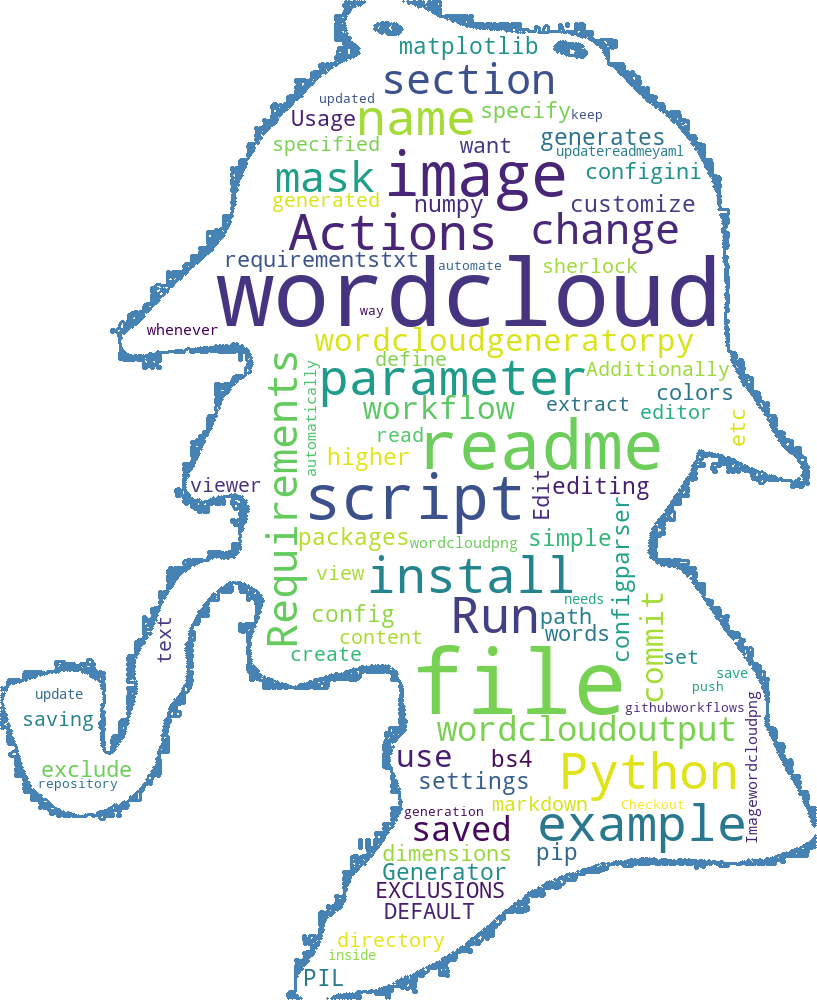

# Wordcloud Generator

This is a simple Python script that generates a wordcloud from a readme file. You can customize the settings of the wordcloud by editing the config file.

## Requirements

- Python 3.6 or higher
- wordcloud
- bs4
- PIL
- numpy
- configparser

## Usage

- Edit the `config.ini` file to change the parameters of the wordcloud, such as the readme file path, the mask file name, the dimensions, colors, etc, in the `[DEFAULT]` section. You can also specify the words you want to exclude from the wordcloud in the `[EXCLUSIONS]` section. Additionally, you can set the `wordcloud_output` parameter to define the name of the wordcloud image file that will be saved.
- Run the `wordcloud-generator.py` script using `python wordcloud-generator.py`.
- The script will read the readme file, extract the text from the markdown content, and create the wordcloud. The wordcloud will be saved as the name specified by the `wordcloud_output` parameter in the same directory.
- You can view the wordcloud image using any image viewer or editor.

## Example

Here is an example of a wordcloud generated from this readme file, using a sherlock mask and saving the image as `wordcloud.png`: 

## GitHub Actions

You can also use GitHub Actions to run the script automatically whenever you commit changes to the readme file. To do this, you can use the workflow file `update-readme.yaml`  from folder `github-actions`, update it to fit your needs and save it inside the `.github/workflows/` form your git repo.

You can see it in practice in [my personal Git repo](https://github.com/RalucaN). 

Feel free to share any feeback.

